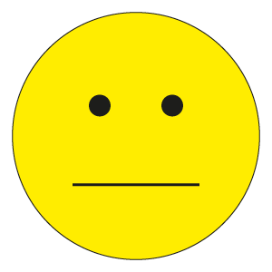
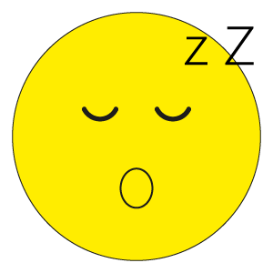
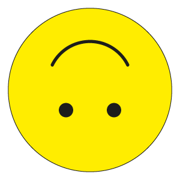
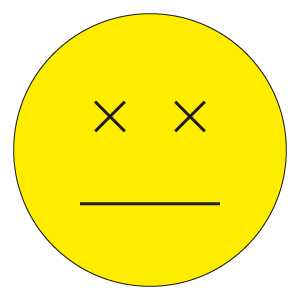

# Hand-Drawn-Emoji-Recognition

## About the Project

There are not many Hand Drawing Emoji Recognitions around; however, I took on the challenge and built my own HDER. The emojis that are supported are:

  
   
  
  
  
  
  
  
  

## Requirements

    <li>Flask==2.1.2</li>

Flask==2.1.2
keras==2.8.0
numpy==1.22.3
Pillow==9.1.1
tensorflow==2.8.0
Turbo_Flask==0.8.0
